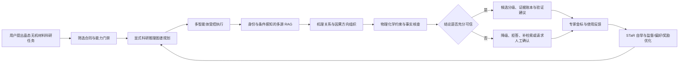

# 多智能体材料科研系统三项创新升级：导师讨论稿

> 文档用途：与导师讨论研究定位、创新边界、数据需求和后续实施顺序  
> 讨论版本：V0.1  
> 日期：2026-09-14  
> 适用范围：晶态无机材料筛选与证据核验  
> 重要说明：本文中的“拟新增”“计划”和“目标”均尚未实现，不应作为现有系统能力对外表述。

## 一、这次讨论希望解决什么

项目目前已经具备多智能体工程闭环，但距离“能够完成一个可审计的小型科研任务”仍有差距。现阶段系统能做数据库筛选、文献检索、CSV 数据分析、候选证据记录和有限流程编排，但仍存在三类核心问题：

1. 多个 Agent 的结果可以串联，但缺少统一、显式、可检查的科研推理结构；
2. 系统可以生成结论，却缺少足够强的物理化学约束、材料身份校验和领域事实核查；
3. 检索结果与回答之间的结合仍偏通用，尚未充分处理物相身份、实验条件、证据冲突和结论适用范围。

因此，拟将导师提出的三个方向整合成一条主线：

> **面向晶态无机材料筛选，构建一个由显式推理图谱驱动、受物理化学机理和领域事实约束、能够通过身份与条件感知 RAG 获取证据，并利用 STaR 自举和人工反馈持续优化的多智能体科研系统。**

这三个方向不是三个互相独立的“附加功能”，而分别回答：

- 系统应该怎样推理；
- 推理和结论怎样受到控制；
- 推理所需事实从哪里来，并怎样用于模型学习。

## 二、项目当前处于什么位置

| 模块 | 当前已经具备的基础 | 尚未解决的问题 |
|---|---|---|
| 主控 Agent | 自动路由、工具调用、基本跨 Agent 串联、失败恢复 | 缺少统一科研推理图和全局科研状态管理 |
| 材料数据库 Agent | 数据库筛选、属性能力门禁、排序、候选快照 | 不支持所有属性；筛选结果尚未自动转化为科研级候选判断 |
| 文献 Agent | 文献检索、PDF 处理、基础 RAG、证据定位 | 材料身份、实验条件、证据可比性和冲突处理仍需加强 |
| 数据分析 Agent | CSV 数据质量检查、描述统计、组间比较、图表和报告基础 | 科研设计、领域解释、机制联系和非技术报告仍未完全闭环 |
| 端到端研究路线 | 筛选合同、Claim–Evidence 账本、有限编排和候选漏斗 | RA-0B 专业金标待审；RA-4 科学综合及以后尚未实施 |
| 测试基线 | 300 条固定材料记录、15 个筛选用例、20 个身份边界用例、3 个端到端任务 | 端到端任务证据仍不完整，缺少专家最终决策和推理标注 |

结论：**不需要推倒重做，但需要对系统的中间表示、校验层、检索层、训练数据和评价体系进行结构性升级。** 原有数据库检索、CSV 分析、文献处理和界面可以保留，作为新方法的工具执行层和对照基线。

## 三、三个创新如何落到同一个系统中

三个创新在流程中的关系为：

1. **显式推理图谱**保存“系统为什么做这一步、依据什么进入下一步”；
2. **控制与校验算法**决定“这一步是否允许执行、这个结论是否允许发布”；
3. **RAG 与模型优化**负责“找到可追溯事实，并让模型逐步学会更好的规划和判断”。

## 四、创新一：STaR 引导的显式科研推理图谱

### 4.1 建议使用的准确表述

STaR 本身更接近“基于正确答案自举优质推理过程”，不等同于完整的强化学习算法。为避免方法表述不严谨，建议论文中优先使用：

> **基于 STaR 自举学习与结果奖励的材料筛选推理轨迹优化方法。**

如果后续确实实现策略优化或偏好优化，再单独增加“强化学习/奖励优化阶段”，不要仅因使用 STaR 就直接声称完成了强化学习。

### 4.2 显式推理图谱要表示什么

不保存不可控的长篇自由思维链，而保存可审计的结构化科研中间状态。建议最小节点包括：

| 节点类型 | 示例 |
|---|---|
| 研究目标 | 筛选具有指定稳定性和带隙范围的晶态无机材料 |
| 范围与定义 | 晶态、无机、是否排除理论未合成材料 |
| 硬约束 | 元素、结构、带隙、稳定性、金属性、数据来源 |
| 候选与身份 | 化学式、材料 ID、空间群、晶型、数据库版本 |
| 证据 | 数据库记录、论文原文位置、实验/计算条件 |
| 机理关系 | 制备条件→结构；结构→性质；性质→性能 |
| 判断状态 | 支持、冲突、证据不足、不适用 |
| 决策 | 保留、降级、排除、待实验验证 |

每条边必须有明确类型，例如“由……支持”“与……冲突”“在……条件下成立”“违反……约束”，从而让不同 Agent 共享同一研究状态，而不是仅传递自然语言摘要。

### 4.3 STaR 训练闭环

1. 系统针对金标任务生成若干候选推理图和执行轨迹；
2. 使用任务结果、硬约束、证据绑定和专家答案进行自动与人工判定；
3. 对错误轨迹提供正确结果，让模型重新生成结构化推理；
4. 只保留通过校验或专家认可的轨迹；
5. 使用这些轨迹进行监督微调；
6. 在独立测试任务上验证是否提高任务成功率，而不是只看回答文字是否更长。

当优质专家数据和奖励函数足够稳定后，再考虑偏好优化或强化学习。奖励可由以下部分组成：

\[
R = w_1R_{task}+w_2R_{constraint}+w_3R_{evidence}+w_4R_{graph}+w_5R_{expert}-P_{violation}
\]

其中分别衡量任务完成、硬约束遵守、证据可追溯、推理图一致性、专家一致性；惩罚项针对物理规律违反、物相误合并、虚构数值和无证据强结论。

### 4.4 这一创新需要的数据

- 研究问题及规范化任务定义；
- 专家给出的正确候选集和最终选择；
- 专家判断的关键步骤顺序，而不仅是最后答案；
- 每一步使用的证据、排除原因和置信度；
- 常见错误路径与纠正结果；
- 系统执行日志：检索、工具参数、候选变化、验证状态。

### 4.5 主要风险

- 自举数据可能放大模型已有错误；
- 奖励指标设计不当会导致“为了得分而绕过科研目标”；
- 没有干预实验数据时，不能把相关关系自动宣传为严格因果关系；
- 应评价结构化推理的正确性，不以暴露自由形式思维链为研究目标。

## 五、创新二：物理化学机理约束与领域事实核查

### 5.1 核心目标

把“系统生成以后再检查”升级为“执行前、执行中、发布前全程控制”。该层应尽量采用确定性规则、可计算约束和可追溯证据，语言模型只负责无法直接计算的语义判断。

### 5.2 三层控制结构

| 阶段 | 主要检查 | 失败后的动作 |
|---|---|---|
| 执行前 | 研究范围、属性定义、单位、数据来源、缺失值策略、是否支持该属性 | 补充设定、拒绝硬筛选或转为探索性分析 |
| 执行中 | 工具参数、化学式、数值范围、材料身份、相结构、硬约束、查询版本 | 阻断、修正参数、重新检索或保留待复核状态 |
| 发布前 | 每个结论是否有证据、不同来源是否可比、是否存在冲突、结论强度是否越界 | 降级措辞、标记证据不足、要求人工确认 |

### 5.3 建议优先实现的规则类型

1. **身份规则**：同一化学式不等于同一材料；必须结合材料 ID、空间群、晶型、制备或计算条件。
2. **单位和量纲规则**：单位不可直接混用；换算必须保留原值、目标值和规则来源。
3. **范围和定义规则**：未登记定义、单位和来源的属性不能直接用于硬筛选。
4. **条件可比性规则**：实验与计算、不同温压、不同测试方法的数据不能无条件合并。
5. **机理方向规则**：以“制备过程→结构→性质→性能”为骨架组织关系，并区分支持、推测和冲突。
6. **证据强度规则**：摘要只能用于背景；候选关键结论应尽量定位到数据库记录、论文正文、表格或图。
7. **结论边界规则**：没有合成证据时，只能称“数据库或计算候选”；没有干预依据时，只能称“机制支持的方向性推断”。

### 5.4 算法输出不应只有通过/失败

建议输出五级状态：

- `pass`：满足规则并有足够证据；
- `conflict`：来源或条件之间存在冲突；
- `insufficient_evidence`：信息不足；
- `unsupported_capability`：当前系统能力不支持；
- `human_review_required`：涉及专业判断，必须进入人工复核。

这使系统可以合理拒答或给出部分结果，而不是为了生成完整报告而做过度推断。

### 5.5 这一创新需要的数据

- 属性字典：定义、单位、方向、适用范围、来源；
- 材料身份映射和容易混淆的负例；
- 物理化学规则及规则出处；
- 文献中的机理关系、作用方向、成立条件和证据位置；
- 专家对“可接受/不可接受结论”的判断；
- 专家指出的典型事实错误、过度概括和错误合并案例。

## 六、创新三：身份与条件感知 RAG，加上可验证的模型优化

### 6.1 不做“普通 RAG”的简单叠加

材料科研中的检索不能只按文本相似度返回段落。拟升级为多源、身份感知和条件感知的检索：

- 结构化数据库：材料属性、结构、计算参数和版本；
- 论文全文：实验方法、条件、结果、图表和结论；
- 机理/因果关系图：材料、过程、结构、属性、性能及其方向关系；
- 项目私有数据：实验 CSV、历史抽取结果、人工修订和候选判断。

检索时先识别材料身份和任务约束，再进行关键词、向量和图谱联合召回，最后依据身份一致性、条件可比性、来源等级和时效性进行重排序。

### 6.2 每条回答都要形成 Claim–Evidence 闭环

每个关键结论至少保存：

- 结论文本；
- 支持或反对该结论的证据；
- 材料身份；
- 数据或实验条件；
- 原始位置；
- 证据强度；
- 冲突状态；
- 系统允许使用的结论强度。

### 6.3 “提示词微调”需要与导师确认含义

该表述可能指三种不同工作：

| 可能含义 | 是否训练模型参数 | 建议用途 |
|---|---:|---|
| 提示词工程 | 否 | 作为可复现基线 |
| Soft Prompt / Prompt Tuning | 只训练少量连续提示参数 | 可作为低成本对照实验 |
| SFT / LoRA | 是 | 最适合学习结构化推理、工具选择和证据表达 |

当前项目更推荐：**RAG + 结构化提示基线 → SFT/LoRA 学习优质轨迹 → 可选偏好优化或强化学习**。算力虽然不是主要限制，但训练方法仍应由数据质量和可验证性决定，而不是单纯追求更大的训练规模。

### 6.4 这一创新需要的数据

- 与端到端任务直接相关的论文全文及页码/段落位置；
- 材料名称、化学式、晶型、空间群、样品和数据库 ID 的对齐；
- 结构化问答、检索查询、正确证据块和困难负例；
- 论文结构化抽取的原始版本、人工修改版本和最终版本；
- 高质量工具调用轨迹和低质量对照轨迹；
- 专家对两个回答或两条推理图的偏好判断。

## 七、现有系统哪些保留，哪些要改

| 现有部分 | 处理方式 | 升级重点 |
|---|---|---|
| CSV 上传与统计分析 | 保留 | 接入研究设计、机理背景、证据核查和非技术报告 |
| 材料数据库筛选 | 保留 | 接入身份图、属性规则和可解释筛选路径 |
| 文献搜索与 PDF 解析 | 保留 | 加入身份/条件感知检索、冲突发现和证据重排序 |
| 多 Agent 路由 | 保留并改造 | 从消息串联变为由显式推理图驱动的状态迁移 |
| Claim–Evidence 账本 | 重点扩展 | 增加条件、冲突、规则验证和结论强度字段 |
| 当前问答界面 | 保留主体 | 展示任务进度、推理图摘要、证据状态和人工复核入口 |
| 当前测试集 | 冻结为基线 | 新增专家金标、推理图金标、错误样例和跨任务测试集 |

## 八、接下来最需要向专业人员收集什么

### 8.1 第一批最小数据包

建议先完成不少于 3 个真实、范围可控的端到端晶态无机材料任务。每个任务至少提供：

1. 原始科研问题、使用场景和任务边界；
2. 可执行的筛选标准，包括硬约束、软排序和缺失值策略；
3. 初始候选全集及数据来源、版本和日期；
4. 人工最终选择、排除候选及逐项理由；
5. 不少于 5 篇直接相关文献，优先提供全文；
6. 每个关键判断对应的证据页码、段落、表格或图；
7. 专家对材料身份、条件可比性、机理关系和结论强度的审核；
8. 如有，提供以往文献结构化任务的原始输出、人工修改和最终结果。

### 8.2 除“最终答案”外，还要补的训练标注

为了支持三个创新，不能只收集“最后选了哪些材料”。还需要：

- 专家判断时先看什么、后看什么；
- 哪一步属于数据库事实、文献事实、机理推断或经验判断；
- 哪些证据真正改变了候选排序；
- 哪些材料看似满足条件但最终被排除，以及排除原因；
- 哪些结论可以直接说，哪些只能保守表达；
- 专家对系统推理的认同、不认同和修改意见。

非材料专业人员可以完成格式整理、原文定位、初步实体标注和双人一致性检查；材料身份合并、机理方向、证据可比性和最终候选结论需要材料领域人员确认。

### 8.3 最终形成的训练数据产品

| 数据产品 | 主要训练目标 |
|---|---|
| 任务—筛选合同对 | 训练任务理解与约束解析 |
| 问题—工具轨迹对 | 训练主控 Agent 的规划和工具选择 |
| 论文—结构化事实对 | 训练实体、条件、属性和证据抽取 |
| 推理图金标 | 训练显式科研推理结构 |
| 正确/错误轨迹对 | 用于 STaR 筛选、偏好训练和错误诊断 |
| 候选集—专家决策对 | 训练和评价候选分级与排序 |
| 规则—违反案例对 | 训练校验器并测试拒答能力 |

训练、验证和测试应按“任务或论文来源”划分，而不是随机拆散相邻文本，避免同一篇论文的信息泄漏到测试集。

## 九、推荐实施路线与每阶段验收条件

### IR-0：冻结现有系统作为基线

交付物：固定代码版本、固定数据库快照、现有 3 个端到端任务和全部当前指标。  
验收：后续所有创新版本都能与该版本进行同条件比较。

### IR-1：定义显式推理图谱和统一状态协议

先以 Fe₂O₃ 晶型任务作为试点，定义节点、边、状态变化和 Agent 读写权限。  
验收：同一任务能够从问题、候选、证据一直追踪到结论，任一结论可反查来源和规则。

### IR-2：实现确定性校验与领域规则层

优先实现材料身份、单位、属性定义、硬约束、来源版本和结论强度规则。  
验收：已知错误样例能够被阻断；无法判断的情况进入待复核而不是强行通过。

### IR-3：升级身份与条件感知的多源 RAG

把数据库记录、论文段落、图表位置和关系图谱统一到材料身份上。  
验收：检索正确证据的比例、证据定位覆盖率和冲突发现能力明显优于普通向量 RAG。

### IR-4：建立专家金标和标注规范

完成至少 3 个真实任务的数据包、推理图标注规范和双人复核流程。  
验收：RA-0B 的专业边界得到签字确认，训练集和独立测试集无来源泄漏。

### IR-5：开展 STaR 自举和 SFT/LoRA

让模型生成多条轨迹，通过规则与专家答案筛选，形成优质训练样本。  
验收：独立任务上的规划成功率、证据正确率和专家一致率提高，同时硬约束违反率下降。

### IR-6：可选的偏好优化或强化学习

只有奖励函数、专家偏好数据和测试集稳定后再进行。  
验收：相较 SFT 版本有稳定增益，且不存在明显奖励投机、过度拒答或过度自信。

### IR-7：消融、泛化和案例研究

分别移除 RAG、规则层、推理图和 STaR 训练，证明各模块的独立贡献。  
验收：完成定量指标、错误分类、跨任务测试和典型端到端案例。

## 十、实验对照与评价指标

### 10.1 建议对照组

| 版本 | 组成 | 用途 |
|---|---|---|
| M0 | 基座模型/当前系统 | 工程基线 |
| M1 | M0 + 普通 RAG | 检验一般检索增益 |
| M2 | M1 + 物理化学与事实校验 | 检验控制层价值 |
| M3 | M2 + 显式推理图谱 | 检验结构化推理价值 |
| M4 | M3 + STaR/SFT | 检验自举训练价值 |
| M5 | M4 + 偏好优化或 RL | 检验奖励优化的额外价值，可选 |

### 10.2 核心指标

- 任务和筛选条件解析准确率；
- 工具选择与参数准确率；
- 材料身份识别/去重准确率；
- 硬约束违反率；
- 正确证据召回率与原文定位覆盖率；
- 推理图节点、关系和最终状态准确率；
- 无证据强结论数量；
- 正确拒答或降级率；
- 候选排序与专家选择的一致性；
- 端到端任务完成率；
- 同一任务重复运行的一致性；
- 单任务时间、调用次数与资源消耗。

不能只用语言流畅度评价，也不能只展示成功案例。应保留失败案例，说明错误来自检索、身份、工具、推理、规则还是证据不足。

## 十一、三种建设方案供导师选择

| 方案 | 内容 | 优点 | 风险 | 建议 |
|---|---|---|---|---|
| A. 展示型最小版 | 在现有系统上增加 RAG、规则提示和推理流程展示 | 开发快 | 容易变成模块拼接，论文创新较弱 | 不建议作为最终方案 |
| B. 分阶段增强版 | 显式推理图 + 确定性校验 + 身份感知 RAG + STaR/SFT，RL 作为后续可选 | 创新形成闭环，能做消融，工程风险可控 | 需要高质量专家数据 | **推荐** |
| C. 完整因果与大规模 RL 版 | 自动因果发现、复杂知识图谱、端到端策略学习 | 理论上限高 | 数据与因果证据要求极高，范围容易失控 | 作为长期方向 |

推荐选择 B。项目有足够算力时，可以提高模型规模、轨迹采样量和训练轮次，但不应跨过金标、奖励校准和独立测试等必要步骤。

## 十二、需要导师在会上明确的事项

1. “强化学习思维链引导（STaR）”希望做到 STaR 自举与 SFT，还是必须增加真正的策略/奖励优化？
2. “因果知识推断”允许定位为机制支持的方向性推断，还是要求进行自动因果发现？若要求后者，是否能够获得干预或实验设计数据？
3. “提示词微调”具体指提示词工程、Soft Prompt，还是 SFT/LoRA？
4. 论文的核心创新是“显式科研推理与控制”，还是三个方向需要同等篇幅？
5. 研究范围是否继续限定为晶态无机材料筛选？是否选择一个材料体系作为主要实验对象、其他体系作为泛化测试？
6. 能否获得材料领域专家对至少 3 个端到端任务的独立判断、证据定位和最终候选结果？
7. 专业金标由几位专家完成，出现分歧时如何裁决？
8. 系统目标是形成“候选与验证建议”，还是要求直接给出可用于实验决策的最终结论？

## 十三、建议在会上这样概括

> 当前系统已经完成多 Agent、数据库、文献和数据分析的基本工程闭环，但还不能把模块串联等同于科研创新。下一步不准备推倒重做，而是在现有工具层之上增加统一的显式科研推理图谱，让每一步候选变化都有证据和状态；增加物理化学机理约束与领域事实校验，使不满足条件的路径被阻断、证据不足的结论被降级；再用身份与条件感知的 RAG 为每个关键结论绑定数据库和文献证据。最后利用专家金标和 STaR 自举生成优质推理轨迹，先做 SFT/LoRA，在奖励可靠后再决定是否进行强化学习。希望本次与导师明确方法边界、核心创新主次以及专业数据能否获得。

## 十四、当前最实际的下一步

在导师确认方案前，不应立即启动大规模训练。最优先完成：

1. 冻结当前系统和测试集，形成不可变化的对照基线；
2. 选定 1 个代表性任务，建议继续使用 Fe₂O₃ 晶型与合成证据任务；
3. 画出该任务的人工标准推理图，并确定节点、边和结论状态；
4. 与材料专业人员确定数据模板，开始收集 3 个以上真实任务；
5. 由导师确认 STaR、RL、因果推断和“提示词微调”的准确技术含义；
6. 只有在上述内容确定后，才锁定新版技术路线并开始代码改造。

## 参考文献

1. Zelikman, E., Wu, Y., Mu, J., & Goodman, N. D. (2022). *STaR: Bootstrapping Reasoning With Reasoning*. Advances in Neural Information Processing Systems, 35. https://arxiv.org/abs/2203.14465
2. Lewis, P., Perez, E., Piktus, A., et al. (2020). *Retrieval-Augmented Generation for Knowledge-Intensive NLP Tasks*. Advances in Neural Information Processing Systems, 33. https://papers.neurips.cc/paper/2020/hash/6b493230205f780e1bc26945df7481e5-Abstract.html
3. Liu, et al. (2026). *A multimodal dataset of causal mechanisms in materials science literature*. Scientific Data. https://www.nature.com/articles/s41597-026-06598-5

